Okay, let's create some Mermaid diagrams to visually illustrate the important relationships between tables in the athenaHealth Data View data warehouse. I'll focus on the key data domains we've outlined so far and create separate diagrams for each.

**Mermaid Diagrams**

**1. Patient Demographics**

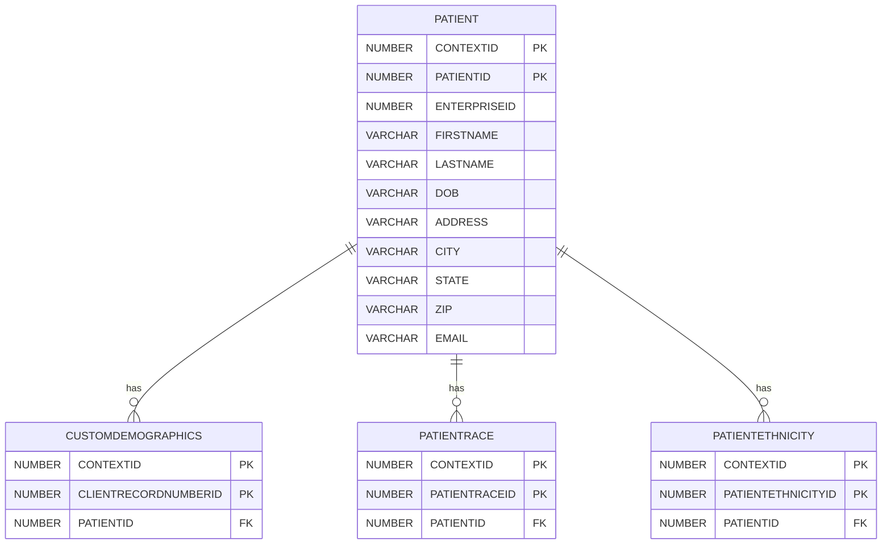
```mermaid
erDiagram
    PATIENT {
        NUMBER CONTEXTID PK
        NUMBER PATIENTID PK
        NUMBER ENTERPRISEID
        VARCHAR FIRSTNAME
        VARCHAR LASTNAME
        VARCHAR DOB
        VARCHAR ADDRESS
        VARCHAR CITY
        VARCHAR STATE
        VARCHAR ZIP
        VARCHAR EMAIL
    }
    CUSTOMDEMOGRAPHICS {
        NUMBER CONTEXTID PK
        NUMBER CLIENTRECORDNUMBERID PK
        NUMBER PATIENTID FK
    }
    PATIENTRACE {
        NUMBER CONTEXTID PK
        NUMBER PATIENTRACEID PK
        NUMBER PATIENTID FK
    }
    PATIENTETHNICITY {
    NUMBER CONTEXTID PK
    NUMBER PATIENTETHNICITYID PK
    NUMBER PATIENTID FK
    }
    PATIENT ||--o{ CUSTOMDEMOGRAPHICS : "has"
    PATIENT ||--o{ PATIENTRACE : "has"
    PATIENT ||--o{ PATIENTETHNICITY : "has"
```

**2. Appointments**

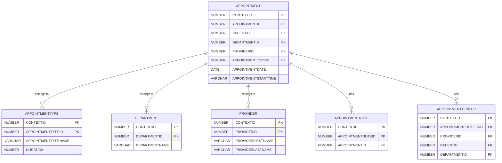
```mermaid
erDiagram
    APPOINTMENT {
        NUMBER CONTEXTID PK
        NUMBER APPOINTMENTID PK
        NUMBER PATIENTID FK
        NUMBER DEPARTMENTID FK
        NUMBER PROVIDERID FK
        NUMBER APPOINTMENTTYPEID FK
        DATE APPOINTMENTDATE
        VARCHAR APPOINTMENTSTARTTIME
    }
    APPOINTMENTTYPE {
        NUMBER CONTEXTID PK
        NUMBER APPOINTMENTTYPEID PK
        VARCHAR APPOINTMENTTYPENAME
        NUMBER DURATION
    }
    DEPARTMENT {
        NUMBER CONTEXTID PK
        NUMBER DEPARTMENTID PK
        VARCHAR DEPARTMENTNAME
    }
    PROVIDER {
        NUMBER CONTEXTID PK
        NUMBER PROVIDERID PK
        VARCHAR PROVIDERFIRSTNAME
        VARCHAR PROVIDERLASTNAME
    }
    APPOINTMENTNOTE {
        NUMBER CONTEXTID PK
        NUMBER APPOINTMENTNOTEID PK
        NUMBER APPOINTMENTID FK
    }
    APPOINTMENTTICKLER {
        NUMBER CONTEXTID PK
        NUMBER APPOINTMENTTICKLERID PK
        NUMBER PROVIDERID FK
        NUMBER PATIENTID FK
        NUMBER DEPARTMENTID FK
    }
    APPOINTMENT ||--o{ APPOINTMENTTYPE : "belongs to"
    APPOINTMENT ||--o{ DEPARTMENT : "belongs to"
    APPOINTMENT ||--o{ PROVIDER : "belongs to"
    APPOINTMENT ||--o{ APPOINTMENTNOTE : "has"
    APPOINTMENT ||--o{ APPOINTMENTTICKLER : "has"
```

**3. Providers**

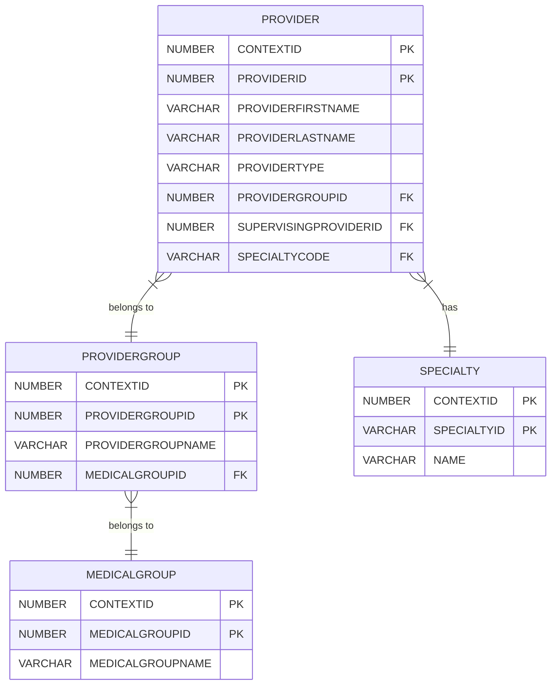
```mermaid
erDiagram
    PROVIDER {
        NUMBER CONTEXTID PK
        NUMBER PROVIDERID PK
        VARCHAR PROVIDERFIRSTNAME
        VARCHAR PROVIDERLASTNAME
        VARCHAR PROVIDERTYPE
        NUMBER PROVIDERGROUPID FK
        NUMBER SUPERVISINGPROVIDERID FK
        VARCHAR SPECIALTYCODE FK
    }
    PROVIDERGROUP {
        NUMBER CONTEXTID PK
        NUMBER PROVIDERGROUPID PK
        VARCHAR PROVIDERGROUPNAME
        NUMBER MEDICALGROUPID FK
    }
    MEDICALGROUP {
        NUMBER CONTEXTID PK
        NUMBER MEDICALGROUPID PK
        VARCHAR MEDICALGROUPNAME
    }
    SPECIALTY {
        NUMBER CONTEXTID PK
        VARCHAR SPECIALTYID PK
        VARCHAR NAME
    }
    PROVIDER }|--|| PROVIDERGROUP : "belongs to"
    PROVIDERGROUP }|--|| MEDICALGROUP : "belongs to"
    PROVIDER }|--|| SPECIALTY : "has"
```

**4. Claims**

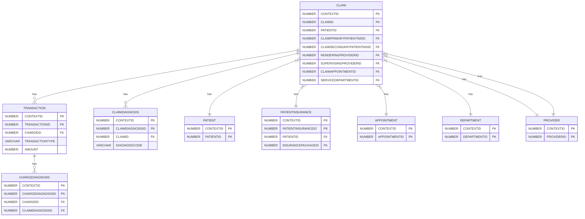
```mermaid
erDiagram
    CLAIM {
        NUMBER CONTEXTID PK
        NUMBER CLAIMID PK
        NUMBER PATIENTID FK
        NUMBER CLAIMPRIMARYPATIENTINSID FK
        NUMBER CLAIMSECONDARYPATIENTINSID FK
        NUMBER RENDERINGPROVIDERID FK
        NUMBER SUPERVISINGPROVIDERID FK
        NUMBER CLAIMAPPOINTMENTID FK
        NUMBER SERVICEDEPARTMENTID FK
    }
    TRANSACTION {
        NUMBER CONTEXTID PK
        NUMBER TRANSACTIONID PK
        NUMBER CHARGEID FK
        VARCHAR TRANSACTIONTYPE
        NUMBER AMOUNT
    }
    CHARGEDIAGNOSIS {
        NUMBER CONTEXTID PK
        NUMBER CHARGEDIAGNOSISID PK
        NUMBER CHARGEID FK
        NUMBER CLAIMDIAGNOSISID FK
    }
    CLAIMDIAGNOSIS {
        NUMBER CONTEXTID PK
        NUMBER CLAIMDIAGNOSISID PK
        NUMBER CLAIMID FK
        VARCHAR DIAGNOSISCODE
    }
    PATIENT {
        NUMBER CONTEXTID PK
        NUMBER PATIENTID PK
    }
    PATIENTINSURANCE {
        NUMBER CONTEXTID PK
        NUMBER PATIENTINSURANCEID PK
        NUMBER PATIENTID FK
        NUMBER INSURANCEPACKAGEID FK
    }
    APPOINTMENT {
        NUMBER CONTEXTID PK
        NUMBER APPOINTMENTID PK
    }
    DEPARTMENT {
        NUMBER CONTEXTID PK
        NUMBER DEPARTMENTID PK
    }
    PROVIDER {
        NUMBER CONTEXTID PK
        NUMBER PROVIDERID PK
    }
    CLAIM }|--|| PATIENT : "has"
    CLAIM }|--|| PATIENTINSURANCE : "has"
    CLAIM }|--|| APPOINTMENT : "has"
    CLAIM }|--|| DEPARTMENT : "has"
    CLAIM }|--|| PROVIDER : "has"
    CLAIM }|--|| PROVIDER : "has"
    CLAIM ||--o{ TRANSACTION : "has"
    TRANSACTION ||--o{ CHARGEDIAGNOSIS : "has"
    CLAIM ||--o{ CLAIMDIAGNOSIS : "has"
```

**5. Clinical Data**

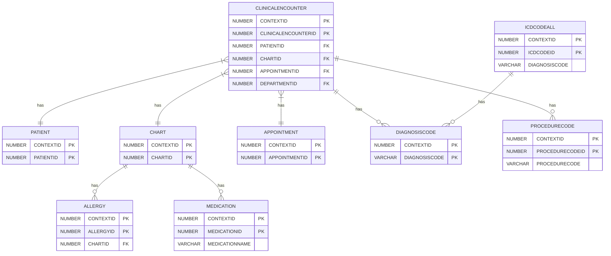
```mermaid
erDiagram
    CLINICALENCOUNTER {
        NUMBER CONTEXTID PK
        NUMBER CLINICALENCOUNTERID PK
        NUMBER PATIENTID FK
        NUMBER CHARTID FK
        NUMBER APPOINTMENTID FK
        NUMBER DEPARTMENTID FK
    }
    PATIENT {
        NUMBER CONTEXTID PK
        NUMBER PATIENTID PK
    }
    CHART {
        NUMBER CONTEXTID PK
        NUMBER CHARTID PK
    }
    APPOINTMENT {
        NUMBER CONTEXTID PK
        NUMBER APPOINTMENTID PK
    }
    DIAGNOSISCODE {
        NUMBER CONTEXTID PK
        VARCHAR DIAGNOSISCODE PK
    }
    ICDCODEALL {
        NUMBER CONTEXTID PK
        NUMBER ICDCODEID PK
        VARCHAR DIAGNOSISCODE
    }
    PROCEDURECODE {
        NUMBER CONTEXTID PK
        NUMBER PROCEDURECODEID PK
        VARCHAR PROCEDURECODE
    }
    MEDICATION {
        NUMBER CONTEXTID PK
        NUMBER MEDICATIONID PK
        VARCHAR MEDICATIONNAME
    }
    ALLERGY {
        NUMBER CONTEXTID PK
        NUMBER ALLERGYID PK
        NUMBER CHARTID FK
    }
    CLINICALENCOUNTER }|--|| PATIENT : "has"
    CLINICALENCOUNTER }|--|| CHART : "has"
    CLINICALENCOUNTER }|--|| APPOINTMENT : "has"
    CLINICALENCOUNTER ||--o{ DIAGNOSISCODE : "has"
    CLINICALENCOUNTER ||--o{ PROCEDURECODE : "has"
    CHART ||--o{ ALLERGY : "has"
    CHART ||--o{ MEDICATION : "has"
    ICDCODEALL ||--o{ DIAGNOSISCODE : "has"
```

**6. Insurance and Billing**

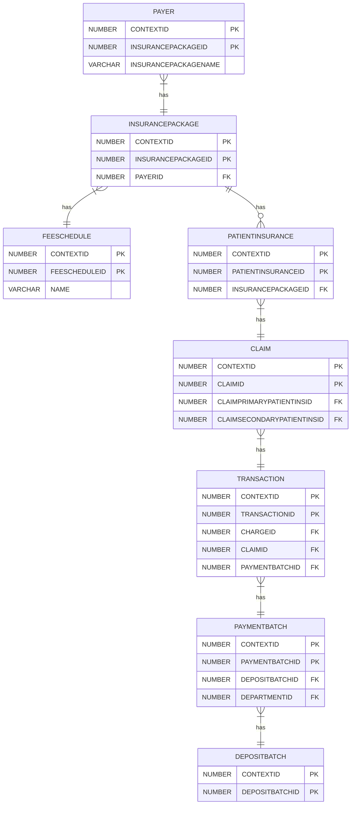
```mermaid
erDiagram
    PAYER {
        NUMBER CONTEXTID PK
        NUMBER INSURANCEPACKAGEID PK
        VARCHAR INSURANCEPACKAGENAME
    }
    INSURANCEPACKAGE {
        NUMBER CONTEXTID PK
        NUMBER INSURANCEPACKAGEID PK
        NUMBER PAYERID FK
    }
    FEESCHEDULE {
        NUMBER CONTEXTID PK
        NUMBER FEESCHEDULEID PK
        VARCHAR NAME
    }
    PAYMENTBATCH {
        NUMBER CONTEXTID PK
        NUMBER PAYMENTBATCHID PK
        NUMBER DEPOSITBATCHID FK
        NUMBER DEPARTMENTID FK
    }
    DEPOSITBATCH {
        NUMBER CONTEXTID PK
        NUMBER DEPOSITBATCHID PK
    }
    CLAIM {
        NUMBER CONTEXTID PK
        NUMBER CLAIMID PK
        NUMBER CLAIMPRIMARYPATIENTINSID FK
        NUMBER CLAIMSECONDARYPATIENTINSID FK
    }
    PATIENTINSURANCE {
        NUMBER CONTEXTID PK
        NUMBER PATIENTINSURANCEID PK
        NUMBER INSURANCEPACKAGEID FK
    }
    TRANSACTION {
        NUMBER CONTEXTID PK
        NUMBER TRANSACTIONID PK
        NUMBER CHARGEID FK
        NUMBER CLAIMID FK
        NUMBER PAYMENTBATCHID FK
    }
    PAYER }|--|| INSURANCEPACKAGE : "has"
    INSURANCEPACKAGE ||--o{ PATIENTINSURANCE : "has"
    PATIENTINSURANCE }|--|| CLAIM : "has"
    CLAIM }|--|| TRANSACTION : "has"
    TRANSACTION }|--|| PAYMENTBATCH : "has"
    PAYMENTBATCH }|--|| DEPOSITBATCH : "has"
    INSURANCEPACKAGE }|--|| FEESCHEDULE : "has"
```

**7. ERA (Electronic Remittance Advice)**

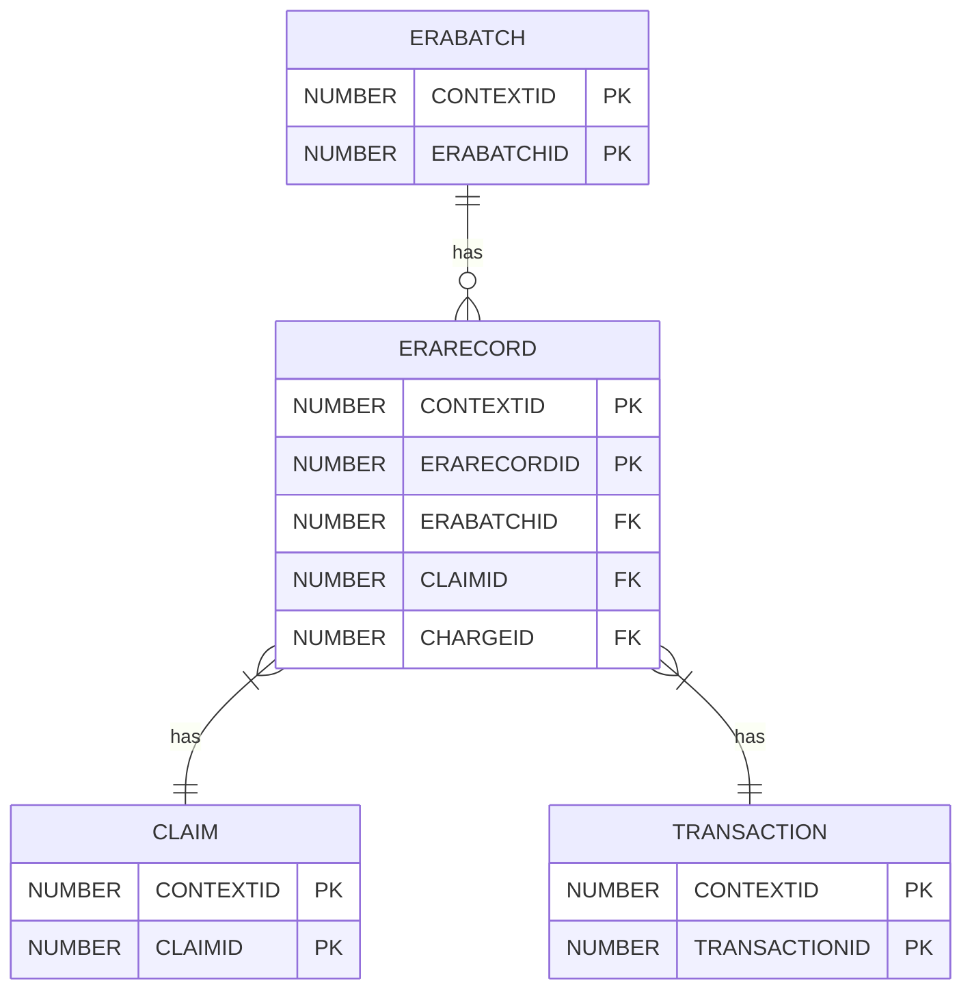
```mermaid
erDiagram
    ERABATCH {
        NUMBER CONTEXTID PK
        NUMBER ERABATCHID PK
    }
    ERARECORD {
        NUMBER CONTEXTID PK
        NUMBER ERARECORDID PK
        NUMBER ERABATCHID FK
        NUMBER CLAIMID FK
        NUMBER CHARGEID FK
    }
    CLAIM {
        NUMBER CONTEXTID PK
        NUMBER CLAIMID PK
    }
    TRANSACTION {
        NUMBER CONTEXTID PK
        NUMBER TRANSACTIONID PK
    }
    ERABATCH ||--o{ ERARECORD : "has"
    ERARECORD }|--|| CLAIM : "has"
    ERARECORD }|--|| TRANSACTION : "has"
```

**8. Scheduling**

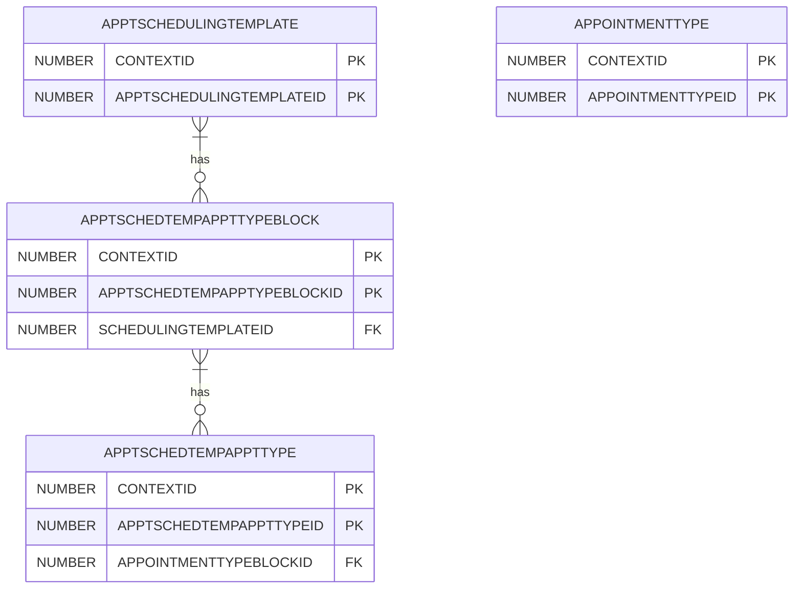
```mermaid
erDiagram
    APPTSCHEDULINGTEMPLATE {
        NUMBER CONTEXTID PK
        NUMBER APPTSCHEDULINGTEMPLATEID PK
    }
    APPTSCHEDTEMPAPPTTYPEBLOCK {
        NUMBER CONTEXTID PK
        NUMBER APPTSCHEDTEMPAPPTYPEBLOCKID PK
        NUMBER SCHEDULINGTEMPLATEID FK
    }
    APPTSCHEDTEMPAPPTTYPE {
        NUMBER CONTEXTID PK
        NUMBER APPTSCHEDTEMPAPPTTYPEID PK
        NUMBER APPOINTMENTTYPEBLOCKID FK
    }
    APPOINTMENTTYPE {
        NUMBER CONTEXTID PK
        NUMBER APPOINTMENTTYPEID PK
    }
    APPTSCHEDULINGTEMPLATE }|--o{ APPTSCHEDTEMPAPPTTYPEBLOCK : "has"
    APPTSCHEDTEMPAPPTTYPEBLOCK }|--o{ APPTSCHEDTEMPAPPTTYPE : "has"
```

**9. Custom Fields**

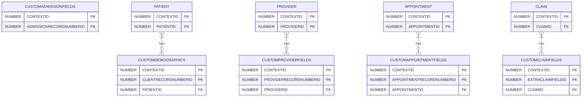
```mermaid
erDiagram
    CUSTOMDEMOGRAPHICS {
        NUMBER CONTEXTID PK
        NUMBER CLIENTRECORDNUMBERID PK
        NUMBER PATIENTID FK
    }
    CUSTOMPROVIDERFIELDS {
        NUMBER CONTEXTID PK
        NUMBER PROVIDERRECORDNUMBERID PK
        NUMBER PROVIDERID FK
    }
    CUSTOMAPPOINTMENTFIELDS {
        NUMBER CONTEXTID PK
        NUMBER APPOINTMENTRECORDNUMBERID PK
        NUMBER APPOINTMENTID FK
    }
    CUSTOMADMISSIONFIELDS {
        NUMBER CONTEXTID PK
        NUMBER ADMISSIONRECORDNUMBERID PK
    }
    CUSTOMCLAIMFIELDS {
        NUMBER CONTEXTID PK
        NUMBER EXTRACLAIMFIELDID PK
        NUMBER CLAIMID FK
    }
    PATIENT {
        NUMBER CONTEXTID PK
        NUMBER PATIENTID PK
    }
    PROVIDER {
        NUMBER CONTEXTID PK
        NUMBER PROVIDERID PK
    }
    APPOINTMENT {
        NUMBER CONTEXTID PK
        NUMBER APPOINTMENTID PK
    }
    CLAIM {
        NUMBER CONTEXTID PK
        NUMBER CLAIMID PK
    }
    PATIENT }|--o{ CUSTOMDEMOGRAPHICS : "has"
    PROVIDER }|--o{ CUSTOMPROVIDERFIELDS : "has"
    APPOINTMENT }|--o{ CUSTOMAPPOINTMENTFIELDS : "has"
    CLAIM }|--o{ CUSTOMCLAIMFIELDS : "has"
```

**10. Departments**

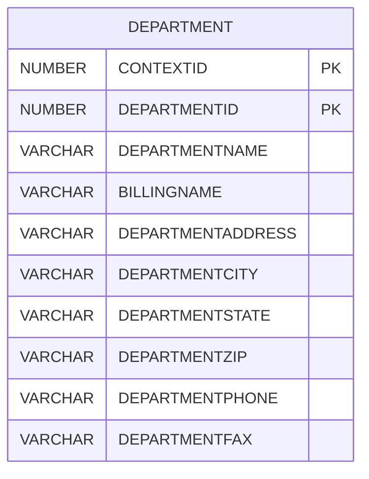
```mermaid
erDiagram
    DEPARTMENT {
        NUMBER CONTEXTID PK
        NUMBER DEPARTMENTID PK
        VARCHAR DEPARTMENTNAME
        VARCHAR BILLINGNAME
        VARCHAR DEPARTMENTADDRESS
        VARCHAR DEPARTMENTCITY
        VARCHAR DEPARTMENTSTATE
        VARCHAR DEPARTMENTZIP
        VARCHAR DEPARTMENTPHONE
        VARCHAR DEPARTMENTFAX
    }

```

**11. Employers**

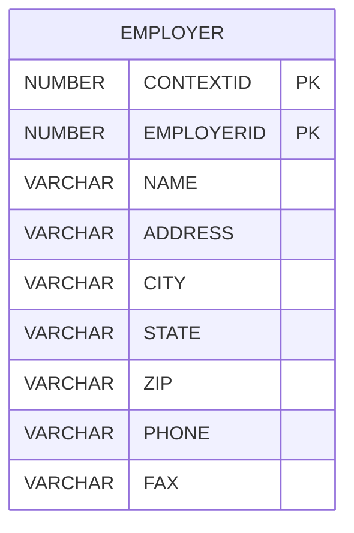
```mermaid
erDiagram
    EMPLOYER {
        NUMBER CONTEXTID PK
        NUMBER EMPLOYERID PK
        VARCHAR NAME
        VARCHAR ADDRESS
        VARCHAR CITY
        VARCHAR STATE
        VARCHAR ZIP
        VARCHAR PHONE
        VARCHAR FAX
    }
```

**12. Fee Schedules**

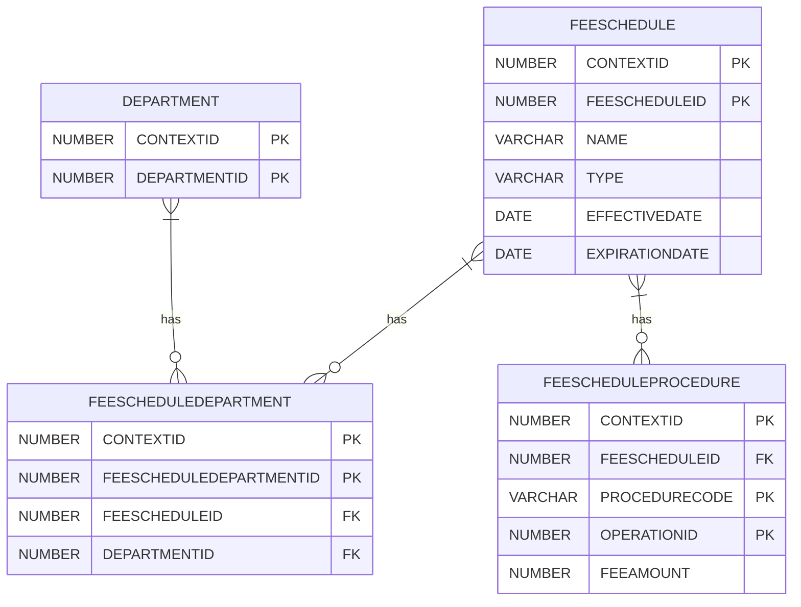
```mermaid
erDiagram
    FEESCHEDULE {
        NUMBER CONTEXTID PK
        NUMBER FEESCHEDULEID PK
        VARCHAR NAME
        VARCHAR TYPE
        DATE EFFECTIVEDATE
        DATE EXPIRATIONDATE
    }
    FEESCHEDULEDEPARTMENT {
        NUMBER CONTEXTID PK
        NUMBER FEESCHEDULEDEPARTMENTID PK
        NUMBER FEESCHEDULEID FK
        NUMBER DEPARTMENTID FK
    }
    FEESCHEDULEPROCEDURE {
        NUMBER CONTEXTID PK
        NUMBER FEESCHEDULEID FK
        VARCHAR PROCEDURECODE PK
        NUMBER OPERATIONID PK
        NUMBER FEEAMOUNT
    }
    DEPARTMENT {
        NUMBER CONTEXTID PK
        NUMBER DEPARTMENTID PK
    }
    FEESCHEDULE }|--o{ FEESCHEDULEDEPARTMENT : "has"
    FEESCHEDULE }|--o{ FEESCHEDULEPROCEDURE : "has"
    DEPARTMENT }|--o{ FEESCHEDULEDEPARTMENT : "has"
```

**13. ICD Codes**

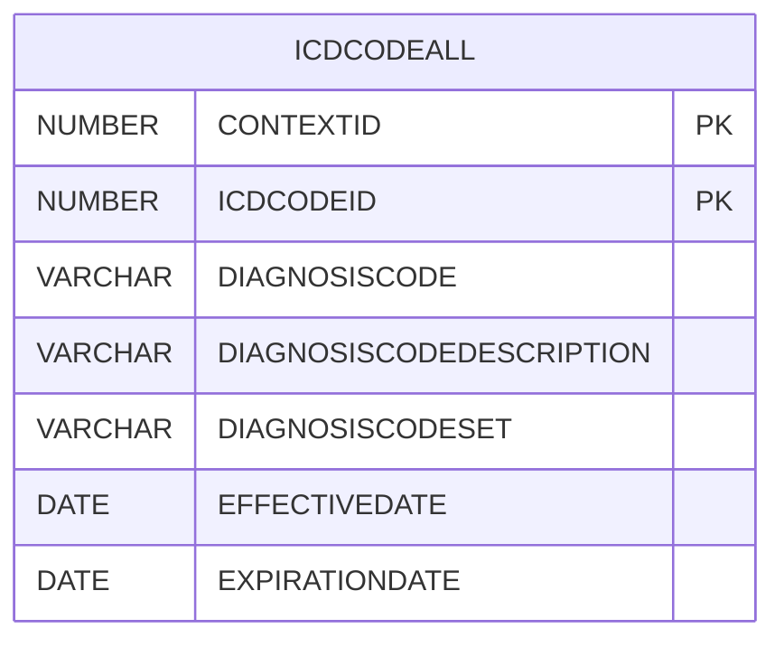
```mermaid
erDiagram
    ICDCODEALL {
        NUMBER CONTEXTID PK
        NUMBER ICDCODEID PK
        VARCHAR DIAGNOSISCODE
        VARCHAR DIAGNOSISCODEDESCRIPTION
        VARCHAR DIAGNOSISCODESET
        DATE EFFECTIVEDATE
        DATE EXPIRATIONDATE
    }
```

**14. Interface Map**

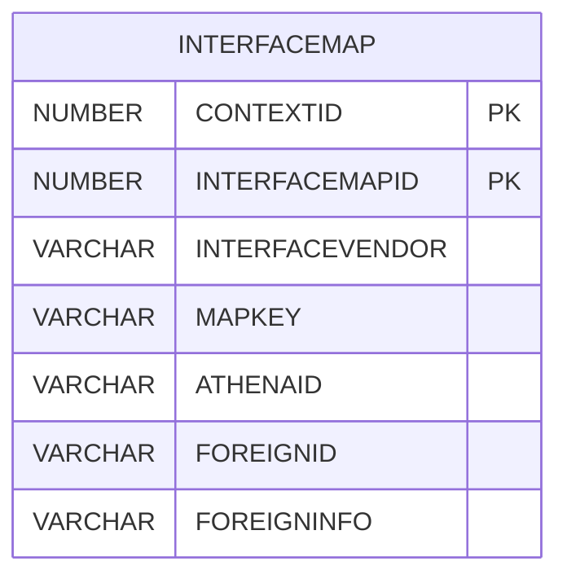
```mermaid
erDiagram
    INTERFACEMAP {
        NUMBER CONTEXTID PK
        NUMBER INTERFACEMAPID PK
        VARCHAR INTERFACEVENDOR
        VARCHAR MAPKEY
        VARCHAR ATHENAID
        VARCHAR FOREIGNID
        VARCHAR FOREIGNINFO
    }
```

**15. LOINC Codes**

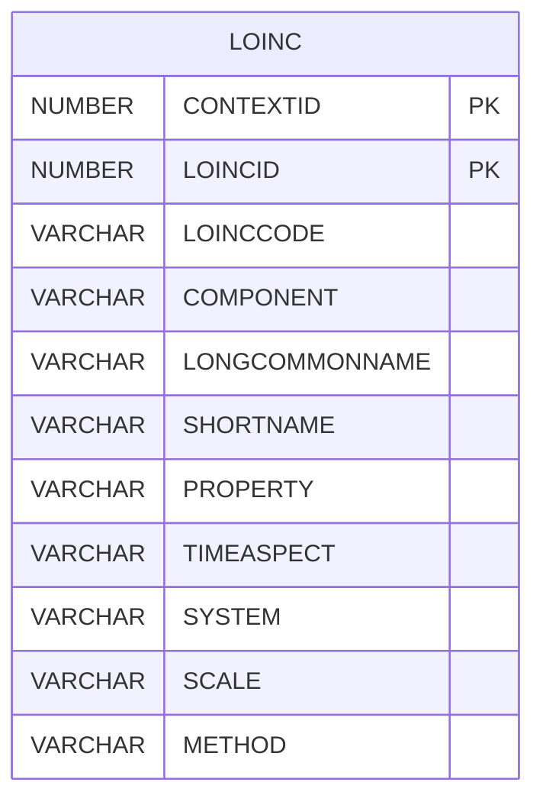
```mermaid
erDiagram
    LOINC {
        NUMBER CONTEXTID PK
        NUMBER LOINCID PK
        VARCHAR LOINCCODE
        VARCHAR COMPONENT
        VARCHAR LONGCOMMONNAME
        VARCHAR SHORTNAME
        VARCHAR PROPERTY
        VARCHAR TIMEASPECT
        VARCHAR SYSTEM
        VARCHAR SCALE
        VARCHAR METHOD
    }
```

**16. Medical Groups**

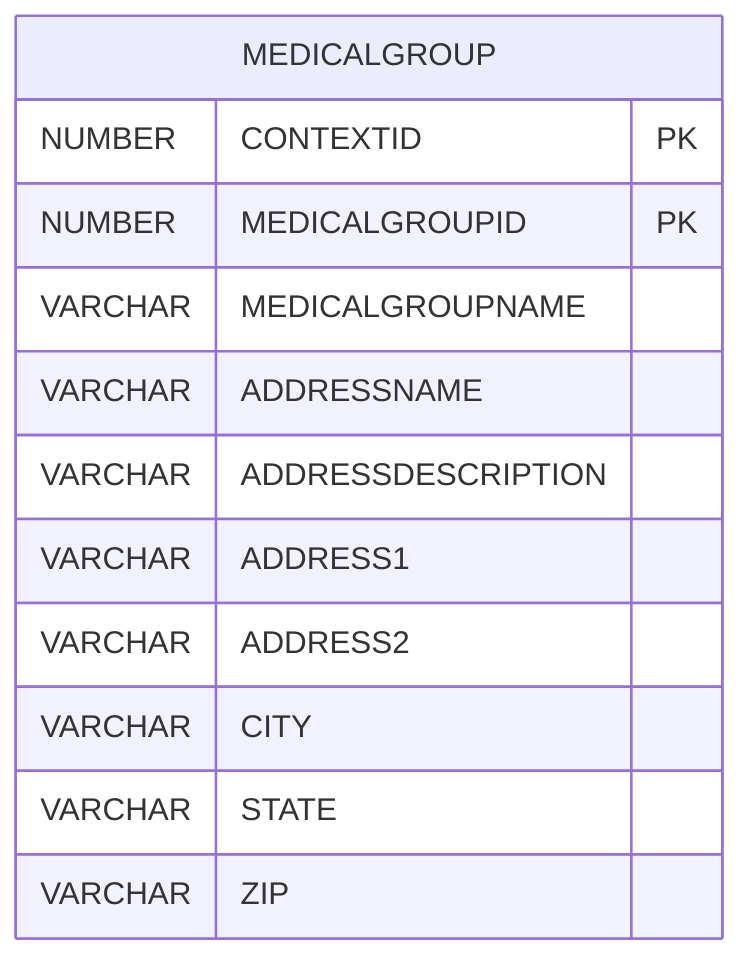
```mermaid
erDiagram
    MEDICALGROUP {
        NUMBER CONTEXTID PK
        NUMBER MEDICALGROUPID PK
        VARCHAR MEDICALGROUPNAME
        VARCHAR ADDRESSNAME
        VARCHAR ADDRESSDESCRIPTION
        VARCHAR ADDRESS1
        VARCHAR ADDRESS2
        VARCHAR CITY
        VARCHAR STATE
        VARCHAR ZIP
    }
```

**17. Patient Account Notes**

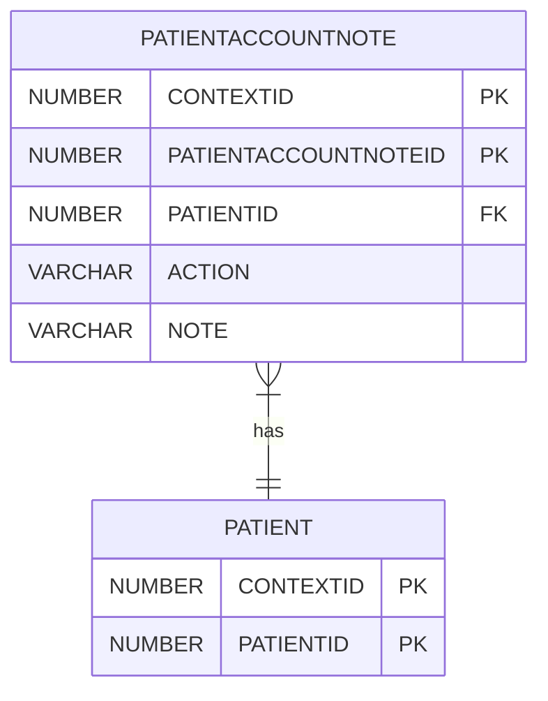
```mermaid
erDiagram
    PATIENTACCOUNTNOTE {
        NUMBER CONTEXTID PK
        NUMBER PATIENTACCOUNTNOTEID PK
        NUMBER PATIENTID FK
        VARCHAR ACTION
        VARCHAR NOTE
    }
    PATIENT {
        NUMBER CONTEXTID PK
        NUMBER PATIENTID PK
    }
    PATIENTACCOUNTNOTE }|--|| PATIENT : "has"
```

**18. Patient Payments**

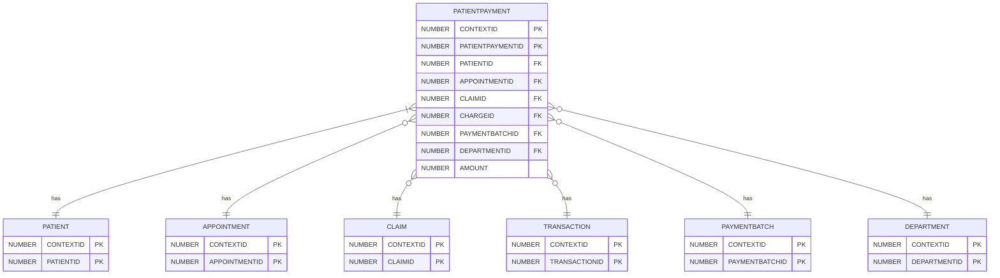
```mermaid
erDiagram
    PATIENTPAYMENT {
        NUMBER CONTEXTID PK
        NUMBER PATIENTPAYMENTID PK
        NUMBER PATIENTID FK
        NUMBER APPOINTMENTID FK
        NUMBER CLAIMID FK
        NUMBER CHARGEID FK
        NUMBER PAYMENTBATCHID FK
        NUMBER DEPARTMENTID FK
        NUMBER AMOUNT
    }
    PATIENT {
        NUMBER CONTEXTID PK
        NUMBER PATIENTID PK
    }
    APPOINTMENT {
        NUMBER CONTEXTID PK
        NUMBER APPOINTMENTID PK
    }
    CLAIM {
        NUMBER CONTEXTID PK
        NUMBER CLAIMID PK
    }
    TRANSACTION {
        NUMBER CONTEXTID PK
        NUMBER TRANSACTIONID PK
    }
    PAYMENTBATCH {
        NUMBER CONTEXTID PK
        NUMBER PAYMENTBATCHID PK
    }
    DEPARTMENT {
        NUMBER CONTEXTID PK
        NUMBER DEPARTMENTID PK
    }
    PATIENTPAYMENT }|--|| PATIENT : "has"
    PATIENTPAYMENT }o--|| APPOINTMENT : "has"
    PATIENTPAYMENT }o--|| CLAIM : "has"
    PATIENTPAYMENT }o--|| TRANSACTION : "has"
    PATIENTPAYMENT }o--|| PAYMENTBATCH : "has"
    PATIENTPAYMENT }o--|| DEPARTMENT : "has"
```

**19. Procedure Codes**

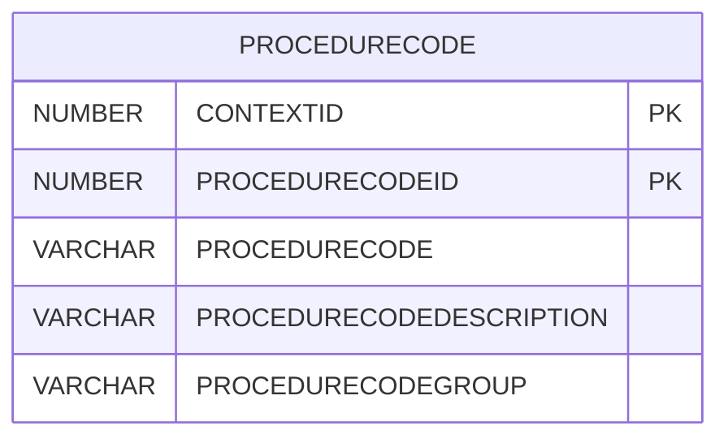
```mermaid
erDiagram
    PROCEDURECODE {
        NUMBER CONTEXTID PK
        NUMBER PROCEDURECODEID PK
        VARCHAR PROCEDURECODE
        VARCHAR PROCEDURECODEDESCRIPTION
        VARCHAR PROCEDURECODEGROUP
    }
```

**20. Referring Providers**

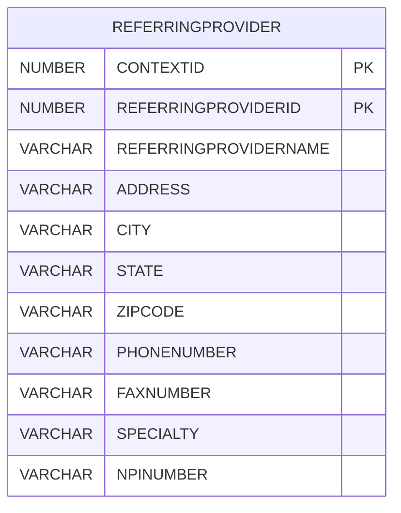
```mermaid
erDiagram
    REFERRINGPROVIDER {
        NUMBER CONTEXTID PK
        NUMBER REFERRINGPROVIDERID PK
        VARCHAR REFERRINGPROVIDERNAME
        VARCHAR ADDRESS
        VARCHAR CITY
        VARCHAR STATE
        VARCHAR ZIPCODE
        VARCHAR PHONENUMBER
        VARCHAR FAXNUMBER
        VARCHAR SPECIALTY
        VARCHAR NPINUMBER
    }
```

**21. Risk Adjustment**

```mermaid
erDiagram
    RISKADJUSTMENTFACTOR {
        NUMBER CONTEXTID PK
        NUMBER RISKADJUSTMENTFACTORID PK
        VARCHAR TYPE
        NUMBER COMMUNITYRAF
        NUMBER INSTITUTIONALRAF
        NUMBER MINIMUMAGE
        NUMBER MAXIMUMAGE
        VARCHAR GENDER
        NUMBER HCCVERSION
        NUMBER HCCID
        VARCHAR HCCDESCRIPTION
    }
```

**22. Unpostables**

```mermaid
erDiagram
    UNPOSTABLE {
        NUMBER CONTEXTID PK
        NUMBER UNPOSTABLEID PK
        NUMBER REVERSALFLAG PK
        NUMBER PAYMENTBATCHID FK
        VARCHAR UNPOSTABLESTATUS
        VARCHAR RESPONSIBLEPARTY
        DATE POSTDATE
        NUMBER AMOUNT
    }
    PAYMENTBATCH {
        NUMBER CONTEXTID PK
        NUMBER PAYMENTBATCHID PK
    }
    UNPOSTABLE }|--|| PAYMENTBATCH : "has"
```

**23. Alerts and Notifications**

*   This domain needs more specific table information to create a meaningful diagram. However, you would likely have tables for:
    *   **Alert Types:** Defining different types of alerts (e.g., lab results, appointment reminders).
    *   **Alert Rules:** Defining the conditions that trigger an alert.
    *   **Alert Instances:** Actual instances of alerts generated for specific patients or providers.
    *   **Notification Preferences:** How users/patients prefer to receive alerts (e.g., email, SMS).

**24. Patient Portal**

*   Similar to Alerts and Notifications, more specific table information is needed. You would likely have tables for:
    *   **Portal Users:** Information about patients and their portal accounts.
    *   **Portal Permissions:** What different users have access to in the portal.
    *   **Portal Activity Log:** Tracking user actions within the portal.
    *   **Portal Forms:** Forms that patients can fill out in the portal.

**25. Clinical Encounter Data:**
```mermaid
erDiagram
  CLINICALENCOUNTERDATA {
    NUMBER CONTEXTID PK
    NUMBER CLINICALENCOUNTERDATAID PK
    NUMBER CLINICALENCOUNTERID FK
    VARCHAR KEY
    NUMBER KEYID
    VARCHAR VALUE
  }
  CLINICALENCOUNTER {
    NUMBER CONTEXTID PK
    NUMBER CLINICALENCOUNTERID PK
  }

  CLINICALENCOUNTER }|--o{ CLINICALENCOUNTERDATA : "has"
```

**Using the Diagrams:**

*   These diagrams can be included in the user guide to provide a visual representation of the table relationships.
*   They can be used in training sessions to help new analysts understand the structure of the data.
*   Analysts can refer to the diagrams when writing queries to make sure they are joining tables correctly.

**Next Steps for Section III:**

1. **Complete the Modules:** Create detailed modules for each of the remaining data domains, following the structure outlined above.
2. **Add More Examples:** Include more complex and varied SQL query examples, focusing on tasks relevant to your organization.
3. **Snowflake Specifics:** Add detailed explanations and examples for Snowflake-specific syntax and functions.
4. **Review and Refine:** Have experienced data analysts review the guide and provide feedback.

By continuing to develop this comprehensive guide, you will equip your new data analysts with the knowledge and tools they need to succeed in their roles and effectively utilize the power of the athenaHealth Data View data warehouse.
